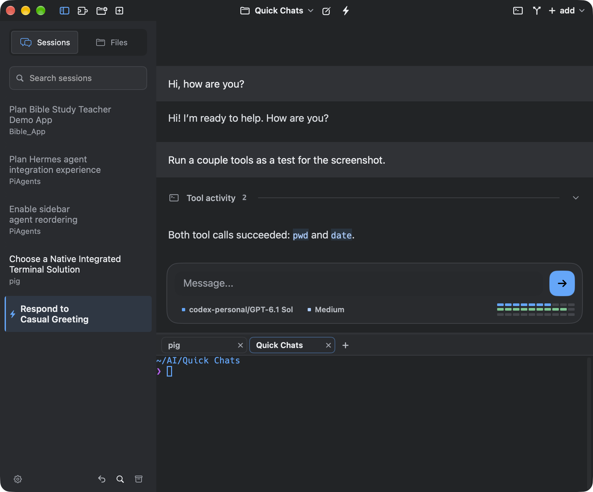
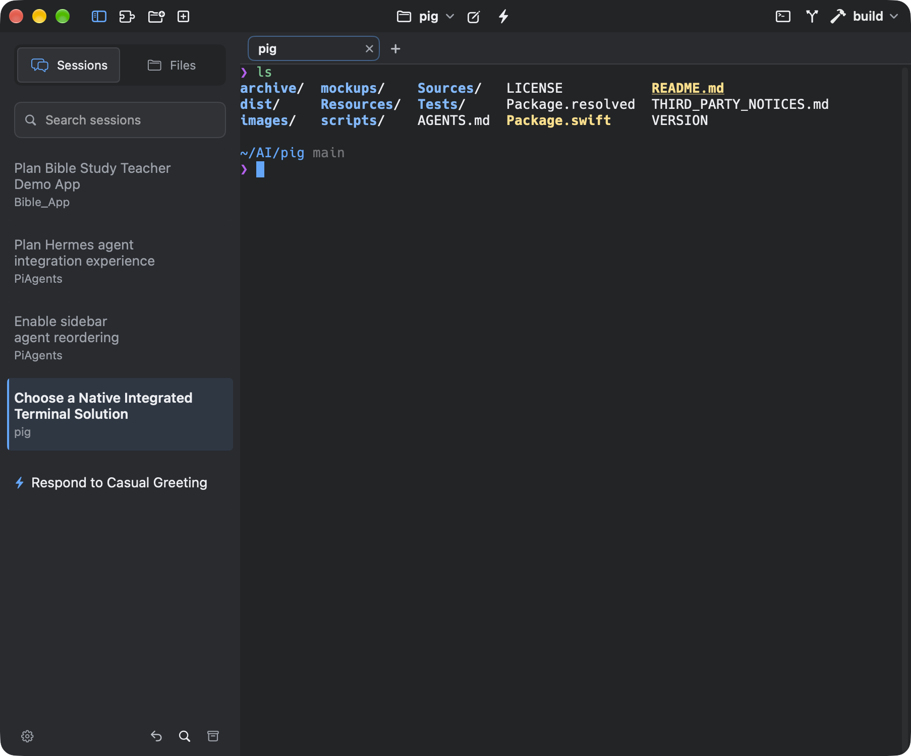
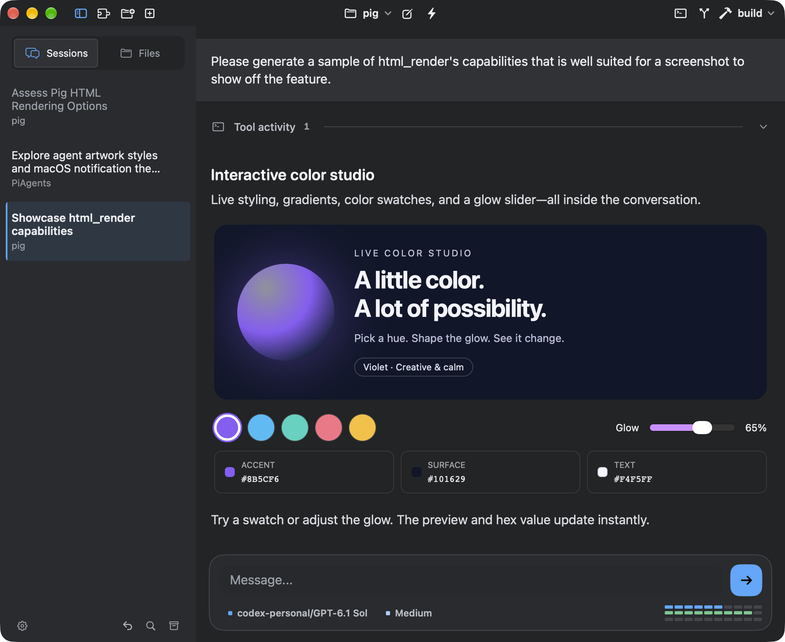

# PiG

<p>
  
  
</p>
<p>
  
  
</p>

PiG is a SwiftUI macOS GUI for the `pi` coding agent.

## Requirements

- macOS 14+ and a Swift toolchain (Xcode or compatible Swift installation)
- `pi` installed

## Features

### Projects & sessions

- Sidebar with projects and their sessions, plus a Files tab
- Project home page listing recent sessions
- Quick Chats: throwaway chats that don't belong to a project
- Session names generated automatically (by the session's model, a model you pick, or Apple Intelligence on the Mac)
- Session tree view: jump to any earlier point in a conversation and fork a new session from a prompt
- Search across all sessions (⌘F) and browse archived sessions
- Several sessions can run at once; idle ones can be unloaded or reloaded
- macOS notification when a reply finishes while you're in another app

### Chat & composer

- Markdown rendering with syntax-highlighted code previews
- Tool activity groups that expand to show commands and file reads
- Detailed views of subagent runs
- Optional display of the model's thinking traces
- Attach images by pasting or dragging
- `@` completion for files and skills, and slash-command suggestions
- Queue steering and follow-up messages while the agent works (Option-Up returns queued messages to the composer)
- Context-usage meter in the composer

### Inline HTML controls



PiG loads a bundled `html_render` extension into its chat-session pi processes.
It does not install anything in pi's agent directory or change standalone pi
sessions.

Ask the agent: **“Write a normal Markdown answer with an interactive counter
between two paragraphs, plus an Explain button that sends you a message.”**
The tool creates small HTML fragments, not full webpages. PiG supplies themed
buttons and inputs, matches the chat background, and measures content height
(up to 1000 pixels). There is no surrounding card or title bar. Explanations
and notes belong in the assistant's Markdown, not in the HTML. Vertical wheel
and trackpad scrolling over ordinary controls scrolls the chat; widgets taller
than the height cap retain internal scrolling.

The tool returns a `[[pig-ui:...]]` marker; the agent puts it on its own line
between paragraphs, outside code fences. PiG replaces it with the controls.
Local JavaScript can change the UI. For agent-facing buttons, the tool declares
`actions: [{ id: "explain", message: "Explain these options." }]` and the HTML
uses `<button data-pig-action="explain">Explain</button>`. A genuine click
shows the exact declared message for confirmation. Sending uses the normal
prompt path (queued as a follow-up if the agent is busy), never shell or local
slash-command execution. Messages are currently static; JavaScript
cannot supply arbitrary message text.

Hover/right-click for Source, Copy HTML, Save HTML, and Reload Controls. Widget
state is temporary and resets on reload/reopening; the original markup and
declared actions remain in session history through tool-result details.

Fragments must be self-contained (up to 256 KiB): inline CSS/JavaScript, SVG,
and data URLs work. The renderer uses an opaque-origin sandboxed iframe,
nonpersistent WebKit storage, CSP, offline content rules, and disabled WebRTC.
A trusted isolated-world script handles only content sizing and allowlisted
button actions; generated JavaScript cannot access the native handler.
Theme CSS variables include `--pig-bg`, `--pig-fg`, `--pig-muted`, `--pig-accent`,
`--pig-panel`, and `--pig-border`. Use `.pig-controls` for a spaced button row,
`.pig-primary` for an accented button, or `.pig-link` for a text button. Save
exports the original fragment; PiG's styling, actions, and sandbox do not apply
when that file is opened in another app.

### Models

- Model and thinking-level pickers for each session
- Quick Model shortcuts (⌘1–⌘5)
- Default model and thinking level for new sessions
- A schedule that picks the default model by time of day and work days
- Usage-limit meters for ChatGPT/Codex, Claude and Grok, shown only when you have credentials for that provider

### pi integration

- Extensions & Resources popover for turning extensions and skills on or off per chat
- Support for extension UI: prompts (select, confirm, input, editor), notifications, status items, widgets, window title
- Pi updates: check for them, update pi and its extensions, and a "What's New" view

### Workspace

- File tree: create, rename and trash files; reveal in Finder; open in Terminal; copy paths and references
- Custom actions: a button in the title bar that runs your saved shell commands for the project, with output shown in the chat
- Built-in terminal ([SwiftTerm](https://github.com/migueldeicaza/SwiftTerm)): fullscreen (⌘⇧F), vertical split (⌘D) or horizontal split (⌘⇧D), with tabs; opens in the session's project folder

### Appearance

- 23 themes, including Nord, Dracula, Tokyo Night, Rosé Pine and GitHub Light
- Adjustable text size (⌘+ / ⌘−)
- Native SwiftUI app for macOS 14+

## Download

Prebuilt Apple silicon builds are on the [Releases](https://github.com/jmcblane/PiG/releases) page. They are ad-hoc signed, not notarized: after the first launch attempt, allow PiG in System Settings → Privacy & Security. PiG checks for new releases at launch and from PiG → Check for Updates…

## Build

```sh
scripts/build-app.sh
open dist/PiG.app
```

`build-app.sh` accepts `--clean`. Its defaults are bundle ID `com.jacob.pig` (the same as release builds, so settings carry over) and ad-hoc signing (`PIG_SIGN_ID=-`). To customize, copy `scripts/build-app.local.env.example` to `scripts/build-app.local.env` and set `PIG_BUNDLE_ID`, `PIG_SIGN_ID`, or `PIG_SIGN_KEYCHAIN` there. The local file is gitignored; explicit environment variables override it. Set `PIG_SIGN_ID` to an existing keychain code-signing identity to use it. A missing named identity fails without changing the keychain; `--create-local-identity` (or `PIG_CREATE_LOCAL_IDENTITY=1`) explicitly opts in to creating and trusting one. Ad-hoc builds are not notarized and may need manual approval in macOS Gatekeeper before opening on another Mac.

PiG stores its data in `~/Library/Application Support/PiG` and reads pi's agent directory (`~/.pi/agent`, or `PI_CODING_AGENT_DIR` if set). If PiG can't find `pi`, set its path in Settings → General.

Optional usage-limit meters read OAuth credentials from pi's `auth.json` and query provider usage endpoints (ChatGPT/Codex and xAI), or run the `claude` CLI. Meters appear only when a matching credential exists.

Third-party licenses are in `THIRD_PARTY_NOTICES.md`.
