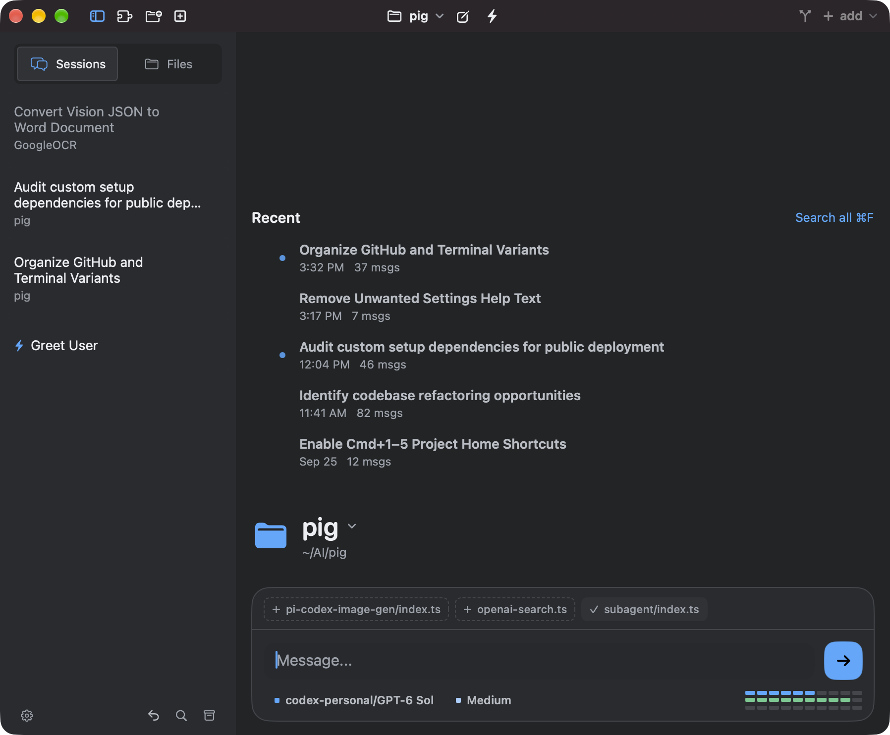
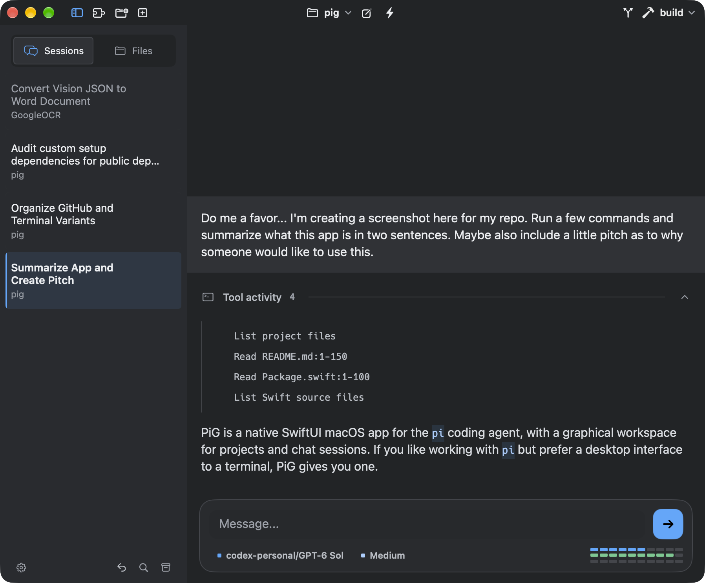

# PiG

<p>
  
  
</p>

PiG is a SwiftUI macOS GUI for the `pi` coding agent.

## Requirements

- macOS 14+ and a Swift toolchain (Xcode or compatible Swift installation)
- `pi` installed

## Build

```sh
scripts/build-app.sh
open dist/PiG.app
```

`build-app.sh` accepts `--clean`. Its defaults are bundle ID `dev.pig.PiG` and ad-hoc signing (`PIG_SIGN_ID=-`). To customize, copy `scripts/build-app.local.env.example` to `scripts/build-app.local.env` and set `PIG_BUNDLE_ID`, `PIG_SIGN_ID`, or `PIG_SIGN_KEYCHAIN` there. The local file is gitignored; explicit environment variables override it. Set `PIG_SIGN_ID` to an existing keychain code-signing identity to use it. A missing named identity fails without changing the keychain; `--create-local-identity` (or `PIG_CREATE_LOCAL_IDENTITY=1`) explicitly opts in to creating and trusting one. Ad-hoc builds are not notarized and may need manual approval in macOS Gatekeeper before opening on another Mac.

PiG stores its data in `~/Library/Application Support/PiG` and reads pi's agent directory (`~/.pi/agent`, or `PI_CODING_AGENT_DIR` if set). If PiG can't find `pi`, set its path in Settings → General.

Optional usage-limit meters read OAuth credentials from pi's `auth.json` and query provider usage endpoints (ChatGPT/Codex and xAI), or run the `claude` CLI. Meters appear only when a matching credential exists.
